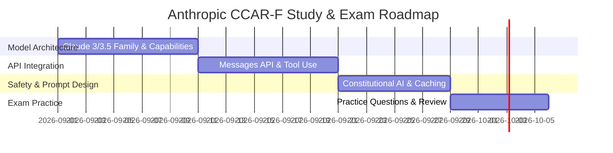

# Anthropic CCAR-F (Claude Certified Architect - Foundation) Exam Guide

---

## 10 Sample Practice Questions

#### Q1: In the Anthropic Claude 3 model family, which model is optimized for maximum execution speed and cost efficiency on high-volume tasks?
- A) Claude 3 Haiku
- B) Claude 3 Opus
- C) Claude 3 Sonnet
- D) Claude 1 Instant
* **Correct Answer**: A
* **Explanation**: Claude 3 Haiku is Anthropic's fastest and most cost-effective model designed for near-instant responses on high-volume workloads.

#### Q2: What mechanism does Anthropic utilize during model alignment to embed ethical principles and behavioral guidelines into Claude models?
- A) Constitutional AI (CAI)
- B) Hardcoded Regular Expression Filtering
- C) Manual Database Deletion
- D) Random Weight Initialization
* **Correct Answer**: A
* **Explanation**: Constitutional AI uses a explicit set of written principles to guide self-critique, fine-tuning, and ethical alignment.

#### Q3: Which top-level parameter in the Anthropic Messages API (`/v1/messages`) specifies the maximum number of tokens generated in a completion response?
- A) `max_tokens`
- B) `temperature`
- C) `top_k`
- D) `stream`
* **Correct Answer**: A
* **Explanation**: `max_tokens` is a mandatory parameter defining the hard upper limit of generated tokens in the API response.

#### Q4: How does Anthropic Claude handle tool use (function calling) via the Messages API?
- A) The client passes JSON tool definitions in `tools`, and Claude returns a `tool_use` content block when invoking a tool
- B) Claude executes local shell scripts directly on the caller's server
- C) Claude modifies database tables directly
- D) Claude reboots the hosting machine
* **Correct Answer**: A
* **Explanation**: Claude returns structured `tool_use` JSON blocks containing the function name and input parameters for the client to execute.

#### Q5: In Anthropic Claude prompt engineering, what structural convention is recommended to demarcate complex source context or retrieved documents?
- A) Wrapping context in XML tags such as `<documents>...</documents>` or `<context>...</context>`
- B) Enclosing text in CSS curly braces `{}`
- C) Writing text as SQL queries
- D) Converting context into HTML table rows
* **Correct Answer**: A
* **Explanation**: Structured XML tags enable Claude to clearly distinguish context parameters, instructions, and input data within long prompts.

#### Q6: What is the maximum context window supported by Anthropic Claude 3 and 3.5 models?
- A) 200,000 tokens
- B) 4,000 tokens
- C) 8,000 tokens
- D) 1,000 tokens
* **Correct Answer**: A
* **Explanation**: Current Anthropic Claude 3 and 3.5 models feature a 200,000 token context window capable of ingesting extensive technical documentation.

#### Q7: Which feature enables Anthropic Claude to analyze technical architecture diagrams, charts, and image screenshots?
- A) Claude Multimodal / Vision API
- B) Audio Transcriber
- C) Code Profiler
- D) SQL Optimizer
* **Correct Answer**: A
* **Explanation**: Claude's vision capabilities allow processing base64 image data alongside text prompts for visual analysis.

#### Q8: How is a system prompt passed when making a request to the Anthropic Messages API?
- A) Via the top-level `system` parameter in the JSON request payload
- B) Inside the user message array as HTML comments
- C) In HTTP header cookies
- D) As a URL parameter in the GET query string
* **Correct Answer**: A
* **Explanation**: System prompts are specified using the dedicated top-level `system` string field in the API request body.

#### Q9: What is the effect of setting `temperature: 0.0` in a Claude API call?
- A) Maximizes response determinism and consistency by selecting greedy token probability paths
- B) Increases random creative variation
- C) Speeds up internet connection speed
- D) Disables API authentication checks
* **Correct Answer**: A
* **Explanation**: A temperature of 0.0 makes model generation deterministic, making it ideal for classification and code tasks.

#### Q10: What is Prompt Caching in the Anthropic API?
- A) Storing large static prompt context blocks (e.g., codebase or documentation) in memory to reduce API cost and latency on subsequent calls
- B) Saving user passwords in browser cache
- C) Deleting API tokens automatically
- D) Clearing server RAM
* **Correct Answer**: A
* **Explanation**: Prompt Caching allows caching long context blocks across requests, providing lower latency and reduced cost for repeated context.

---

## Domain Overview Matrix

| Architecture Domain | Key Concepts | Weighting |
| :--- | :--- | :--- |
| **Model Family & Selection** | Claude 3.5 Sonnet, Haiku, Opus | 25% |
| **API Integration & Tool Use** | Messages API, `tool_use`, Streaming | 30% |
| **Prompt Engineering & Context** | XML Structuring, Prompt Caching, System Prompts | 25% |
| **Safety & Alignment** | Constitutional AI, System Moderation | 20% |

---

## Preparation Recommendation

Engineers preparing for the Anthropic CCAR-F certification can evaluate their architecture knowledge using a [CCAR-F practice test](https://www.certsclub.com) to test their understanding of Claude API integration, tool calling, and prompt caching.
