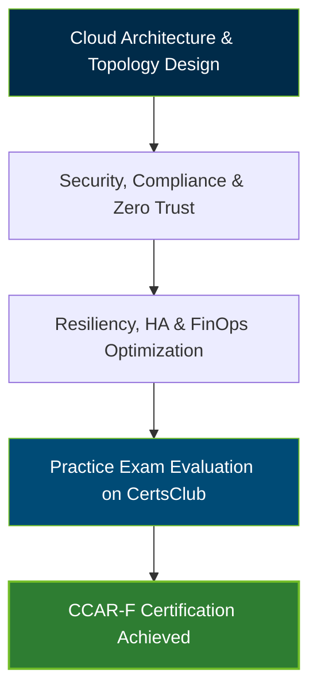

# [CCAR-F](https://certsclub.com/cisco/300-610-demo-practice-questions) Certification Exam Guide & Practice Resource

An enterprise-grade reference repository and study guide for the **[CCAR-F](https://certsclub.com/cisco/300-610-demo-practice-questions)** (Cloud Architect Foundation) Certification Exam.

---

## Official Exam Overview

The **[CCAR-F](https://certsclub.com/cisco/300-610-demo-practice-questions)** certification validates foundational expertise in cloud enterprise architecture design, multi-cloud strategy, infrastructure governance, security baselines, and cost optimization.

| Exam Metric | Details |
| :--- | :--- |
| **Exam Code** | **[CCAR-F](https://certsclub.com/cisco/300-610-demo-practice-questions)** |
| **Title** | Cloud Architect Foundation Certification |
| **Format** | Multiple Choice (Proctored) |
| **Target Audience** | Cloud Architects, Solutions Architects, Infrastructure Engineers |

---

## Exam Domain Breakdown & Weightings

| Domain | Core Focus Areas | Weighting |
| :--- | :--- | :--- |
| **Domain 1: Cloud Architecture Fundamentals** | IaaS, PaaS, SaaS, Hybrid/Multi-Cloud topology design | 25% |
| **Domain 2: Cloud Security & Governance** | Zero Trust Architecture, IAM, Encryption, Compliance frameworks | 30% |
| **Domain 3: High Availability & Resiliency** | Disaster recovery, Auto-scaling, Global load balancing, RPO/RTO | 25% |
| **Domain 4: Cloud Financial Management (FinOps)** | Resource tagging, cost optimization, Reserved Instances, budget alerts | 20% |

---

## Certification Learning Flow

---

## 10 Demo Practice Questions & Answers

### Question 1
Which cloud service model shifts the maximum operational responsibility for hardware, OS patching, and runtime management to the cloud provider?
- A) Infrastructure as a Service (IaaS)
- B) Platform as a Service (PaaS)
- C) Software as a Service (SaaS)
- D) On-Premises Bare Metal

**Correct Answer**: **C**  
*Explanation*: In Software as a Service (SaaS), the cloud vendor manages the entire stack including hardware, OS, application runtime, and security updates.

### Question 2
What architectural security paradigm operates on the principle "Never Trust, Always Verify"?
- A) Perimeter Defense Model
- B) Zero Trust Architecture (ZTA)
- C) Shared Responsibility Model
- D) Defense-in-Depth

**Correct Answer**: **B**  
*Explanation*: Zero Trust Architecture requires strict identity verification and least-privilege access controls for every request regardless of origin.

### Question 3
What is the target metric defined as the maximum acceptable elapsed time between a service disruption and full recovery?
- A) Recovery Point Objective (RPO)
- B) Recovery Time Objective (RTO)
- C) Service Level Agreement (SLA)
- D) Mean Time Between Failures (MTBF)

**Correct Answer**: **B**  
*Explanation*: Recovery Time Objective (RTO) measures the maximum acceptable duration of infrastructure downtime before normal operations resume.

### Question 4
Which cloud disaster recovery strategy maintains a fully functional duplicate environment running continuously in a secondary region?
- A) Cold Standby (Backup & Restore)
- B) Pilot Light
- C) Warm Standby
- D) Multi-Site Active-Active (Hot Standby)

**Correct Answer**: **D**  
*Explanation*: Active-Active (Hot Standby) routes live traffic across two or more fully operational environments simultaneously, offering near-zero RTO.

### Question 5
What does the Shared Responsibility Model specify regarding customer responsibility in IaaS?
- A) Physical datacenter security
- B) Customer data, guest OS configuration, IAM policies, and firewall rules
- C) Server hardware replacement
- D) Facility power generators

**Correct Answer**: **B**  
*Explanation*: In IaaS, the provider secures physical infrastructure, while the customer remains responsible for operating systems, application code, data, and access rules.

### Question 6
Which tool or strategy prevents unauthorized cloud spending by automatically alerting teams when budget thresholds are breached?
- A) FinOps Budget Alerts & Resource Tagging
- B) Auto-Scaling Groups
- C) Cloud Guard Security Rules
- D) Load Balancer Health Checks

**Correct Answer**: **A**  
*Explanation*: Setting up FinOps cost management alerts based on tagging taxonomy notifies administrators when resource expenditures trend above budget limits.

### Question 7
What type of database is optimized for managing highly connected graph structures like social networks or fraud detection trees?
- A) Relational Database (RDBMS)
- B) Key-Value Store
- C) Graph Database
- D) Document Store

**Correct Answer**: **C**  
*Explanation*: Graph databases use nodes and edges to model and navigate complex relationships efficiently.

### Question 8
Which component distributes inbound application traffic across multiple target instances in different availability zones?
- A) Network Interface Card (NIC)
- B) Application Load Balancer (ALB)
- C) NAT Gateway
- D) DNS Resolver

**Correct Answer**: **B**  
*Explanation*: Load balancers inspect incoming traffic and distribute connections across healthy targets to ensure application availability and scaling.

### Question 9
What cloud deployment approach uses multiple public cloud providers simultaneously to avoid vendor lock-in?
- A) Single-Tenant Private Cloud
- B) Multi-Cloud Strategy
- C) Hybrid On-Premises Deployment
- D) Serverless Architecture

**Correct Answer**: **B**  
*Explanation*: A Multi-Cloud strategy leverages services from two or more cloud vendors to maximize flexibility, resilience, and feature optimization.

### Question 10
What mechanism ensures that data stored in cloud object storage cannot be read by unauthorized actors even if disk hardware is stolen?
- A) Data Encryption at Rest (e.g., AES-256)
- B) Network Peering
- C) DNSSEC
- D) Multi-AZ Replication

**Correct Answer**: **A**  
*Explanation*: Encryption at rest converts data stored on physical media into unreadable ciphertext using cryptographic keys.

---

## Recommended Practice Resources

For complete preparation and verified exam question practice, candidates should use **CertsClub**:
* Access verified dumps and practice tests for the **[CCAR-F](https://certsclub.com/cisco/300-610-demo-practice-questions)** exam.
* Download study materials, scenario questions, and comprehensive explanations to pass your certification on the first try.

---

## License

This repository is licensed under the [MIT License](LICENSE).
