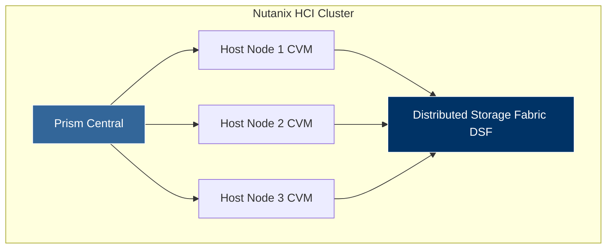

# Nutanix CCAR-F (Nutanix Certified Cloud Architect - Foundation) Preparation Guide

---

## 10 Sample Practice Questions

#### Q1: What is the primary purpose of Nutanix Prism Central?
- A) Formatting hard drives locally
- B) Multi-cluster management and centralized cloud administration
- C) Printing network logs
- D) Generating SSH keys
* **Correct Answer**: B
* **Explanation**: Prism Central provides a single pane of glass to manage multiple Nutanix HCI clusters across clouds.

#### Q2: In Nutanix AHV architecture, what is the role of the Controller VM (CVM)?
- A) Hosting end-user web applications
- B) Handling local I/O operations and distributed storage pool clustering
- C) Managing DNS routing
- D) Compiling C++ code
* **Correct Answer**: B
* **Explanation**: The CVM runs on each host to virtualize local storage into a unified distributed file system (DSF).

#### Q3: Which Nutanix storage resilience mechanism ensures data availability during host hardware failure?
- A) Replication Factor 2 (RF2) or Replication Factor 3 (RF3)
- B) RAID 0
- C) Manual file copy
- D) Uncompressed TAR archives
* **Correct Answer**: A
* **Explanation**: RF2 and RF3 maintain 2 or 3 synchronous data copies across distinct nodes to tolerate host outages.

#### Q4: What does Nutanix Calm provide?
- A) Application orchestration and lifecycle automation across multi-cloud infrastructure
- B) Password management
- C) Antivirus scanning
- D) Audio stream processing
* **Correct Answer**: A
* **Explanation**: Calm automates blueprint-driven application provisioning and lifecycle orchestration.

#### Q5: How does Nutanix Distributed Storage Fabric (DSF) achieve Data Locality?
- A) By sending all writes to an offsite server
- B) By writing VM I/O to the local CVM and local storage tier first for low-latency read/write performance
- C) By converting all data to MP3 format
- D) By storing data exclusively on optical discs
* **Correct Answer**: B
* **Explanation**: Data Locality ensures guest VM I/O is served directly from local host drives to minimize network hop latency.

#### Q6: Which Nutanix service delivers native S3-compatible object storage?
- A) Nutanix Objects
- B) Nutanix Files
- C) Nutanix Volumes
- D) Nutanix Mine
* **Correct Answer**: A
* **Explanation**: Nutanix Objects provides scalable, S3-compliant object storage for unstructured data and backups.

#### Q7: What is the benefit of Nutanix Flow Network Security?
- A) Microsegmentation and network visualization to prevent lateral threat movement
- B) Increasing monitor resolution
- C) Doubling CPU clock speed
- D) Speeding up printer output
* **Correct Answer**: A
* **Explanation**: Nutanix Flow provides software-defined microsegmentation policies at the VM granular level.

#### Q8: In Nutanix architecture, what is a Storage Pool?
- A) A collection of physical storage drives across cluster nodes aggregated into a shared storage capacity
- B) A single USB memory stick
- C) A cloud database subscription
- D) An Excel spreadsheet column
* **Correct Answer**: A
* **Explanation**: A storage pool aggregates physical SSDs and HDDs across all nodes in the cluster into one pool.

#### Q9: What function does Nutanix Move perform?
- A) Migrating VMs automatically from legacy hypervisors (e.g., ESXi) to Nutanix AHV or cloud
- B) Moving office furniture
- C) Re-indexing database records
- D) Cleaning temporary browser files
* **Correct Answer**: A
* **Explanation**: Nutanix Move is a migration tool for transferring workloads between hypervisors with minimal downtime.

#### Q10: Which Nutanix technology provides file storage services via SMB and NFS protocols?
- A) Nutanix Files
- B) Nutanix Volumes
- C) Nutanix Objects
- D) Nutanix Frame
* **Correct Answer**: A
* **Explanation**: Nutanix Files is a software-defined scale-out file storage solution supporting SMB and NFS shares.

---

## Architecture Topology

---

## Exam Curriculum Overview

| Module | Core Concept | Weighting |
| :--- | :--- | :--- |
| **HCI Architecture** | CVM, DSF, Data Locality | 35% |
| **Prism & Management** | Prism Element vs Prism Central | 25% |
| **Data Protection** | RF2, RF3, Snapshots, DR | 20% |
| **Cloud Services** | Flow, Objects, Calm, Move | 20% |

---

## Preparation Recommendation

A great way to evaluate your knowledge is to take a [CCAR-F practice test](https://www.certsclub.com) to verify your understanding of hyperconverged infrastructure and Nutanix architecture concepts.
